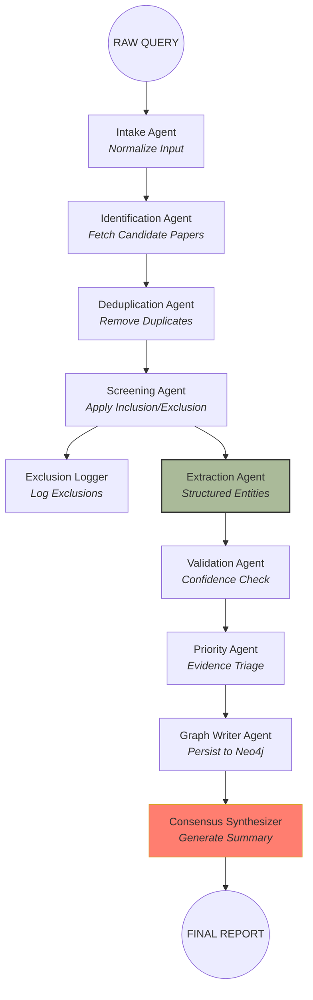
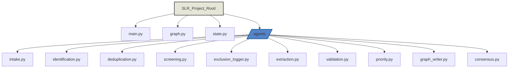
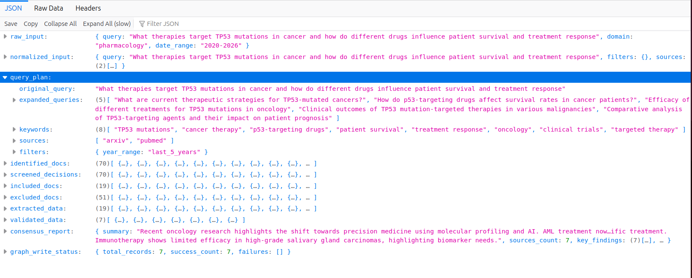
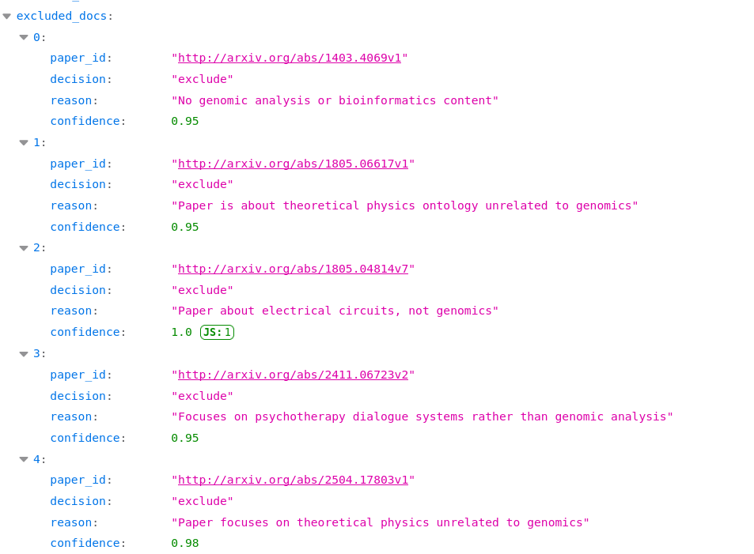
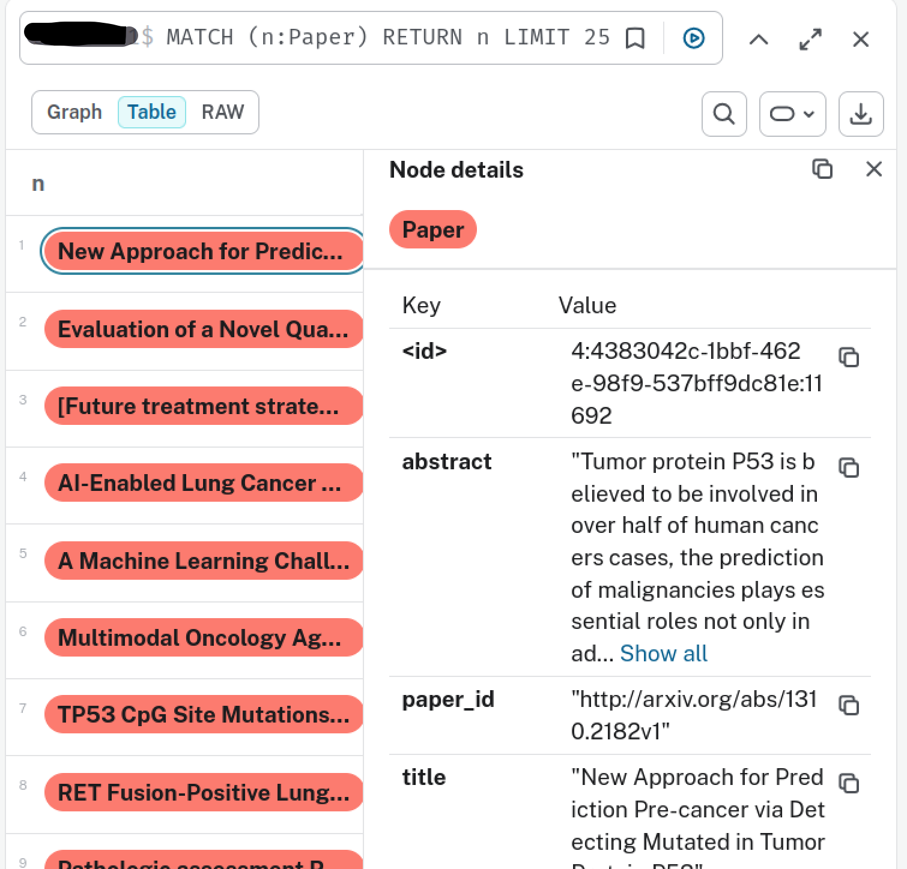
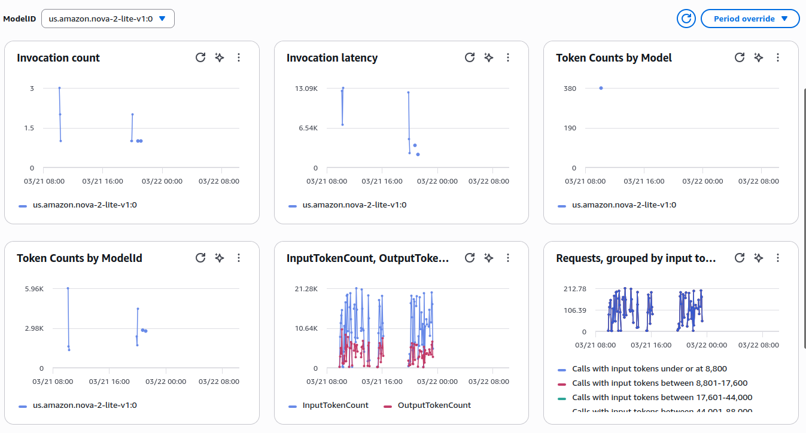

# 🧬 SLR Multi-Agent System for Biomedical Knowledge Extraction
## LLM-Powered Multi-Agent AI for Transforming Systematic Reviews in Genomics & Biomedicine
### Author: Aditya Wresniyandaka, Spring 2026
## 🔬 Project Overview: Systematic Literature Review (SLR) Multi-Agent Knowledge Extraction

The pace of biomedical literature growth far outstrips human ability to synthesize insights. A single systematic review may involve hundreds of publications across multiple domains and study types.

This SLR Multi-Agent System automates literature triage, structured knowledge extraction, validation, and consensus synthesis using Amazon Nova 2 Lite and a LangGraph orchestration engine.

The architecture follows <a href="https://www.prisma-statement.org/">PRISMA</a> guidelines, ensuring transparent inclusion/exclusion criteria, reproducible evidence extraction, and structured reporting of key findings. Each agent in the system mirrors a step in the SLR workflow, from document identification and de-duplication, through screening and data extraction, to validation, prioritization, and consensus synthesis.

## 🏗️ Architecture: the "Scientific Reasoning Cell"

Unlike a simple linear pipeline, the SLR system operates as a directed acyclic graph (DAG) of collaborating agents. Each invocation creates an ephemeral reasoning cell where agents communicate, validate, and reconcile findings.

### 🤖 The Multi-Agent ensemble
<ol> 
<li>
<b>Intake & Normalization Agents</b> 
<ul> 
<li><b>Intake Agent</b>: standardizes queries, ensures domain consistency, and validates date ranges or research scope</li> 
<li><b>Identification Agent</b>: searches biomedical databases (PubMed, ArXiv) to identify relevant publications.</li> <li><b>Deduplication Agent</b>: removes duplicate records to maintain a unique candidate set.</li> </ul> </li> <li><b>Screening & Exclusion Layer</b> 
<ul> <li><b>Screening Agent</b>: applies inclusion/exclusion criteria to evaluate the relevance of candidate papers.</li> 
<li><b>Exclusion Logger</b>: tracks excluded papers and logs reasoning for transparency and audit.</li> 
</ul> 
</li> 
<li><b>Extraction & Validation Layer</b> 
<ul> 
<li><b>Extraction Agent</b>: parses structured biomedical entities and relationships from abstracts and full texts using Amazon Nova 2 Lite. Ensures JSON output is machine-readable and valid. Supports error recovery for blocked or malformed responses.</li> 
<li><b>Validation Agent</b>: checks extraction confidence and flags uncertain or content-filtered entries for review.</li> 
<li><b>Priority Agent</b>: assigns priority tiers to evidence based on confidence, study type, and domain rules.</li>
</ul>
</li> 
<li><b>Graph Persistence & Synthesis</b> 
<ul> 
<li><b>Graph Writer Agent</b>: persists validated entities and relationships into a **Neo4j Aura** graph database. Tracks success/failure of writes and maintains audit logs.</li> 
<li><b>Consensus Synthesizer Agent</b>: aggregates structured data and generates final narrative summaries, key findings, and priority breakdowns. Resolves conflicts between agents and ensures evidence-supported conclusions.</li> 
</ul> 
</li> 
</ol>

### High-level diagram of the agents


## 🌐 Stateless Execution & Architectural Design

The SLR Multi-Agent system leverages a stateless reasoning cell model, inspired by serverless design patterns:

<ul>
<li><b>Instantiation:</b> each query spawns an ephemeral LangGraph cell, isolating memory and processing.</li> <li><b>Execution:</b> all agents run in-memory, passing state dictionaries (`SLRState`) through the DAG.</li> <li><b>Ephemeral infrastructure:</b> the reasoning cell is destroyed after final report generation, leaving no persistent sensitive data.</li>
<li><b>Horizontal scalability:</b> stateless design enables thousands of simultaneous SLR jobs with no cross-session interference.</li>
<li><b>Cost efficiency:</b> only active compute is billed; idle time is eliminated.</li>
<li><b>Versioned reasoning:</b> every Docker image is immutable and versioned, providing full reproducibility and audit trails.
</li> 
</ul>

## Code respository structure
> <b>Proprietary Notice:</b> due to proprietary elements in the underlying implementation and specialized genomic reasoning logic, the full source code for this project is not publicly available. The structure below illustrates the modular architecture of the SLR.



### Sample initial input payload
```
initial_state: SLRState = {
    "raw_input": {
        "query": "Effectiveness of DrugA in TherapyX for BRCA1 mutation patients",
        "domain": "pharmacology",
        "date_range": "2020-2026"
    },
    "identified_docs": None,
    "screened_docs": None,
    "eligible_docs": None,
    "excluded_docs": None,
    "extracted_data": None,
    "validated_data": None,
    "priority_scores": None,
    "write_to_graph": None,
    "consensus_report": None

    }
```
## Tracebility and audit logs

To support reproducibility and transparency, the system includes built-in traceability mechanisms across the entire multi-agent pipeline.

Each agent emits structured logs during execution (e.g., identification, screening decisions, extraction outputs, and validation outcomes), allowing users to trace how a final conclusion was derived. Intermediate states can be serialized and exported as JSON, capturing the full lifecycle of the SLR workflow—from raw query to final consensus report.

Key Capabilities
<ul>
<li><b>Step-by-step traceability:</b> each agent logs its decisions, enabling inspection of inclusion/exclusion reasoning, extracted entities, and prioritization outcomes.</li>
<li><b>State persistence:</b> the full `SLRState` object can be dumped to a JSON file, providing a complete snapshot of the pipeline at any stage.</li>
<li><b>Audit-ready outputs:</b> enables reproducible analysis and supports review of decision pathways, aligning with systematic review standards (e.g., PRISMA).</li>
<li><b>Debugging & observability:</b> fine-grained logs make it easier to identify issues such as JSON parsing errors, content filtering, or low-confidence extractions.</li>
</ul>

This design ensures that every result produced by the system is explainable, inspectable, and reproducible; key requirements for biomedical and clinical research workflows.

### Sample log of the steps performed
```
Running intake_agent...
Running query_builder_agent...
Running identification_agent...
Identified 70 papers.
Running deduplication_agent...
Deduplicated papers: 70 -> 70 (removed 0)
Running screening_agent...
Screened 70 papers: 19 included, 51 excluded.
Running extraction_agent...
Running validation_agent...
Validating record for paper_id: http://arxiv.org/abs/1310.2182v1
Validating record for paper_id: pubmed:41809820
Validating record for paper_id: pubmed:41761287
Validating record for paper_id: pubmed:41496439
Validating record for paper_id: pubmed:41247518
Validating record for paper_id: pubmed:40769918
Validating record for paper_id: pubmed:40459096
Validating record for paper_id: http://arxiv.org/abs/2402.09476v1
Validating record for paper_id: http://arxiv.org/abs/2402.10717v2
Validating record for paper_id: http://arxiv.org/abs/2402.11788v1
Validating record for paper_id: http://arxiv.org/abs/1306.2584v2
Validating record for paper_id: http://arxiv.org/abs/2101.11935v1
Validating record for paper_id: http://arxiv.org/abs/2512.05824v1
Validating record for paper_id: pubmed:41858121
Validating record for paper_id: pubmed:41707338
Validating record for paper_id: pubmed:41665720
Validating record for paper_id: pubmed:41477271
Validating record for paper_id: pubmed:41421851
Validating record for paper_id: pubmed:41320659
Validated 7 papers, rejected 12 papers
Running priority_agent...
Validated data for priority scoring: [{'entity1': 'azacitidine', 'type': 'treatment_for', 'entity2': 'AML', 'paper_id': 'pubmed:40769918', 'title': '[Future treatment strategies ...']}]
Priority scores: [{'paper_id': 'pubmed:40769918', 'score': 0.51, 'priority': 'medium', 'confidence': 0.85, 'num_entities': 0},...]
Writing record to graph: pubmed:40769918
Writing record to graph: http://arxiv.org/abs/2402.09476v1
Writing record to graph: http://arxiv.org/abs/2101.11935v1
Writing record to graph: http://arxiv.org/abs/2512.05824v1
Writing record to graph: pubmed:41858121
Writing record to graph: pubmed:41707338
Writing record to graph: pubmed:41421851
Running consensus_synthesizer_agent...
```

### Summary of the SLR multi-agent flow

Before interacting with external literature sources, the system transforms raw user input into a structured query plan that guides downstream agents.

Rather than issuing a single naive search, the Intake and Query Builder agents perform input normalization and semantic expansion, converting the user’s research question into a set of targeted, reproducible search strategies.

Workflow overview
<ul>
<li><b>Raw Input → Normalized Input:</b> user queries are standardized into a structured format, ensuring consistency across domains (e.g., genomics, pharmacology).</li>
<li><b>Keyword extraction:</b> key biomedical concepts (e.g., genes, drugs, methods) are identified to anchor the search space.</li>
<li><b>Query expansion:</b> the system generates semantically related terms (e.g., “deep learning” → “neural networks”, “CNN”, “transformers”) to improve recall across heterogeneous literature sources.</li>
<li><b>Source selection:</b> configurable relevant data sources (e.g., PubMed, arXiv) based on the research domain.</li>
<li><b>Temporal filtering:</b> a configurable date range (e.g., 2020–2026) is applied to prioritize recent and clinically relevant studies.</li>
</ul>
Why this matters
<ul> <li><b>Improved recall:</b> captures relevant papers that would be missed by exact keyword matching.</li> <li><b>Reproducibility:</b> the generated query plan can be logged and reused, ensuring consistent literature retrieval.</li>
<li><b>Domain awareness:</b> tailors search strategies based on biomedical context rather than generic search heuristics.</li>
</ul>

This structured query planning layer acts as the foundation of the SLR pipeline, ensuring that downstream agents operate on a high-quality and contextually relevant set of candidate papers.



### Sample reasoning of excluded papers

The following papers were excluded during the screening phase based on predefined relevance criteria. Each exclusion decision was made with a high confidence score, supported by the model’s assessment of domain relevance, methodological alignment, and applicability to the research question.



### Sample output (consensus summary)

The output below reflects the final output of the end-to-end execution of the multi-agent SLR pipeline. Starting from 70 candidate papers identified through query expansion, the system performed deduplication, screening, and structured extraction, ultimately yielding 7 validated studies. These were prioritized based on confidence scores, entity richness, and inferred evidence strength, forming the basis for the final consensus synthesis.

```
=== Final Consensus Report ===

Recent oncology research highlights the shift towards precision medicine using molecular profiling and AI. AML treatment now emphasizes personalized strategies with new drug combinations and genomic testing. Lung cancer prognosis has improved through AI integration, while machine learning shows promise in head/neck cancer survival prediction. Multimodal approaches like MOA enhance glioma mutation predictions. TP53 mutations impact lung adenocarcinoma chemoimmunotherapy outcomes, and RET fusions require partner-specific treatment. Immunotherapy shows limited efficacy in high-grade salivary gland carcinomas, highlighting biomarker needs.

Key Findings:
- Personalized AML treatment strategies now incorporate molecular profiling and novel therapeutics
- AI improves lung cancer prognosis accuracy and enables personalized interventions
- Machine learning enhances head/neck cancer survival predictions when combining clinical and imaging data
- Multimodal data integration improves mutation prediction in gliomas
- TP53 mutation subtypes affect lung adenocarcinoma treatment responses
- RET fusion-positive lung cancers require partner-specific therapeutic approaches
- Immunotherapy shows limited efficacy in high-grade salivary gland carcinomas

Priority Breakdown:
- High: 4 papers
- Medium: 2 papers
- Low: 1 papers

Total Papers Analyzed: 7
```
### Sample paper metadata stored as nodes in Neo4j



## 🛠️ Infrastructure & Deployment Strategy
### Containerization & Serverless Orchestration
<ul>
<li>Engine: powered by LangGraph within a FastAPI wrapper, providing a stateful, iterative reasoning process.
<li>Environment: packaged as a Docker container and hosted on Amazon ECR.
<li>Orchestration: deployed via Amazon Bedrock AgentCore. This allows the system to remain stateless and purely consumption-based—only incurring costs when an interpretation is requested.
</ul>
Sample configuration can be viewed at my other paper: <a href="https://github.com/adityatw/var-intel-cell">Variant Intelligence Cell (VIC)</a>

### GenAI Observability amd runtime telemetry in CloudWatch

The system integrates with AWS CloudWatch GenAI Observability to provide real-time visibility into model usage and agent execution behavior.

Each pipeline invocation is instrumented to capture key metrics such as token consumption, latency, and model interactions, enabling detailed inspection of how the multi-agent system performs under real workloads.

This observability layer enables performance tuning, cost optimization, and operational transparency, ensuring that the system can scale efficiently while maintaining high-quality outputs.




### Performance & Cost Discovery
<ul>
<li>Efficiency: by utilizing a serverless runtime, we eliminated the need for 24/7 EC2 compute, reducing idle infrastructure costs to nearly $0.
<li>Cost breakdown:
<ul>
<li>90% Model Reasoning: investment in high-reasoning tokens for accurate clinical insights.
<li>10% Orchestration: minimal overhead for container execution and data transfer.
</ul>
</ul>

## 📖 Key Technical Learnings
<ul>
<li>LLM outputs are inconsistent; robust JSON parsing and error repair are essential.</li>
<li>Content filters may block outputs; pipeline gracefully handles blocked or incomplete responses.</li> <li>Multi-agent orchestration with LangGraph simplifies branching, retries, and conditional reasoning.</li>
<li>Neo4j graph enables complex querying and downstream visualization of relationships.</li>
<li>Priority scoring and validation steps ensure reliable consensus reports.</li>
<li>Stateless execution ensures privacy, auditability, and horizontal scalability.</li> 
</ul>

## 🚀 Next Steps
<ul>
<li>Streamlit front-end to submit queries and visualize graph data.</li>
<li>Email or webhook notifications with query results.</li>
<li>PRISMA-compliant systematic review outputs.</li>
<li>Expanded entity/relationship extraction (multi-domain).</li> 
<li>Improved LLM repair strategies for JSON extraction.</li> </ul>

## Environment specifications
To ensure reproducibility and performance consistency, the **VIC** pipeline was developed and validated in the following environment:

| Component        | Specification |
|:-----------------|:--------------|
| **Workstation OS** | Ubuntu 24.04.3 LTS (Noble Numbat) |
| **Development runtime** | Python 3.13 |
| **Compute/Docker build** | AWS EC2 t4g.small (2 vCPUs, ARM64 Graviton) |
| **Base AMI** | al2023-ami-2023.9.20251208.0-kernel-6.1-arm64 |
| **Architecture** | Linux/arm64 |
| **Container runtime** | Python 3.11-slim (Docker/ARM64) |

## 📖 Citation & acknowledgments

If you find this work useful, please cite or link to this GitHub repository. You are welcome to adapt and extend the ideas presented here, provided that appropriate credit is given.

📚 BibTeX
```
@software{SLRMultiAgentSystem2026,
  author       = {Aditya Wresniyandaka},
  title        = {SLR Multi-Agent System for Biomedical Knowledge Extraction},
  year         = {2026},
  url          = {https://github.com/adityatw/slr-cell},
  note         = {LLM-Powered Multi-Agent AI for Transforming Systematic Reviews in Genomics & Biomedicine}
}
```

### AI Collaboration Disclosure
This project utilizes AI-assisted documentation. <b>ChatGPT</b> was used to synthesize technical findings and refine the architectural presentation found in this README. This disclosure maintains transparency regarding the role of generative AI in augmenting human-led research and development.

Design and code © 2026 <a href="https://www.linkedin.com/in/aditya-wresniyandaka-3b2670" target = "_blank">Aditya Wresniyandaka</a> | Built and tested with Python 3.13